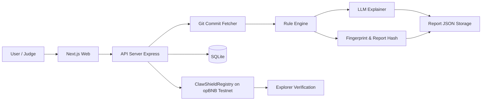

# ARCHITECTURE

## Components
- Web: audit submission, report visualization, and attestation trigger UI.
- API: orchestrates audit jobs, score calculation, report persistence, and onchain writes.
- Contract: immutable attestation events with attester accountability.
- Storage: SQLite for operational state, report JSON for reproducible evidence.
