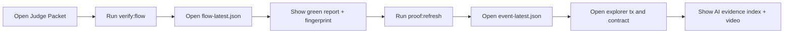

# DEMO_RUNBOOK

## Storyboard Flow

## Demo Inputs (Fixed for consistency)

- Repo URL: `https://github.com/octocat/Hello-World`
- Commit SHA: `7fd1a60b01f91b314f59955a4e4d4e80d8edf11d`
- Contract: `0x8F4aF898fc2f28281D2a51d322b586C1DA0481f9`
- Proof TX: `0x7c4b2c3d5bb8dd1aaa34c9dd7a218b0ab91f607d9faac237b40d6500378eab77`

## Judge Demo Steps

1. Open `docs/JUDGE_PACKET.md` and show quick snapshot.
2. Run `npm run verify:flow --workspace @clawshield/api`.
3. Open `docs/verification/flow-latest.json`, highlight:
   - `audit.status = done`
   - `audit.level = green`
   - `attestFirst.body.txHash`
   - `attestSecond.body.reused = true`
4. Run `npm run proof:refresh --workspace @clawshield/api`.
5. Open `docs/verification/event-latest.json` and show decoded event fields.
6. Open explorer links from `docs/PROOF_INDEX.md`.
7. Open `docs/ai-log/EVIDENCE_INDEX.md`, point to 6 closed-loop cases.
8. Play `media/video/clawshield-demo.mp4` (90s).

## Consistency Checklist

- Contract and tx in README, submission docs, video script, and runbook must match.
- `flow-latest.json`, `event-latest.json`, and `STATUS.md` timestamps should be recent.
- If tx changes, refresh:
  - `npm run proof:refresh --workspace @clawshield/api`
  - `npm run submission:generate --workspace @clawshield/api`
