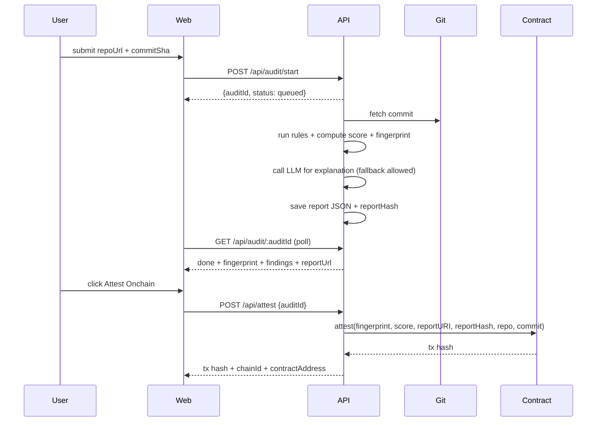

# FLOW_AUDIT_TO_CHAIN

```mermaid
sequenceDiagram
  participant User
  participant Web
  participant API
  participant Git
  participant Contract

  User->>Web: submit repoUrl + commitSha
  Web->>API: POST /api/audit/start
  API-->>Web: {auditId, status: queued}
  API->>Git: fetch commit
  API->>API: run rules + compute score + fingerprint
  API->>API: call LLM for explanation (fallback allowed)
  API->>API: save report JSON + reportHash
  Web->>API: GET /api/audit/:auditId (poll)
  API-->>Web: done + fingerprint + findings + reportUrl
  User->>Web: click Attest Onchain
  Web->>API: POST /api/attest {auditId}
  API->>Contract: attest(fingerprint, score, reportURI, reportHash, repo, commit)
  Contract-->>API: tx hash
  API-->>Web: tx hash + chainId + contractAddress
```
