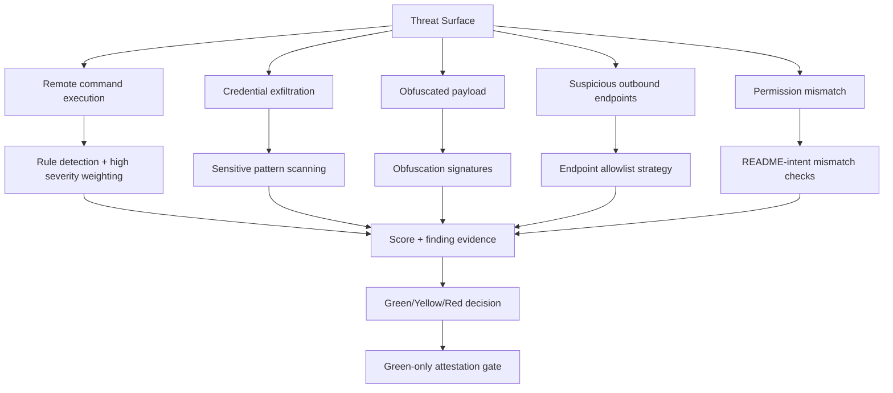

# THREAT_MODEL

## Security Boundaries
- Contract does not judge risk semantics; it stores attestation facts.
- API enforces attestation policy and audit preconditions.
- LLM cannot override deterministic score and level.
