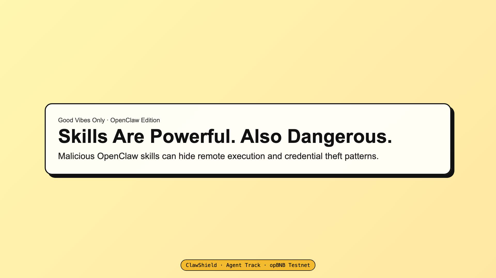
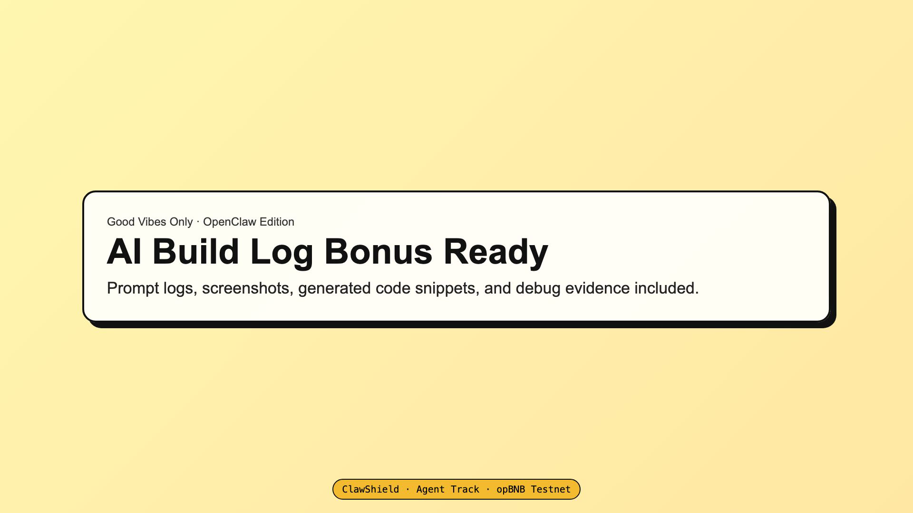

# ClawShield Showcase (Screens + Cases + Evidence)

This page consolidates all key local demo screenshots and case evidence in one place.

- Source run: `docs/cases/artifacts/run-latest.json`
- Verify result: `docs/cases/artifacts/verify-latest.json`
- Case lock: `docs/cases/case-registry.lock.json`
- Detailed writeup: `docs/cases/CASEBOOK.md`

## 1) Case Snapshot

| Case | Problem | Repo / Commit | Result | Attestation | Quick Evidence |
|---|---|---|---|---|---|
| `clean_baseline` | Low-risk baseline | `octocat/Hello-World@7fd1a60` | `0 / green` | `allowed` (onchain tx) | `artifacts/clean_baseline/flow.json` |
| `remote_execution_risk` | Remote execution pattern | `Homebrew/install@5838cad` | `99 / red` | `denied by policy` | `artifacts/remote_execution_risk/flow.json` |
| `credential_access_risk` | Credential access pattern | `OWASP/NodeGoat@c5cb68a` | `63 / yellow` | `denied by policy` | `artifacts/credential_access_risk/flow.json` |

---

## 2) Case A: clean_baseline

### Key Data
- Audit ID: `90c93df0-8512-4e18-b267-ccc7dfc33f45`
- Repo: `https://github.com/octocat/Hello-World`
- Commit: `7fd1a60b01f91b314f59955a4e4d4e80d8edf11d`
- Score / Level: `0 / green`
- Attestation TX: `0x8edd560fb3ba17aa8f3f289e23f625ebaa5ccce5c94bf329b881d46190e9d216`

### UI Screens
#### Home

#### Audit Detail

#### Fingerprint History

### Evidence Files
- `artifacts/clean_baseline/audit.json`
- `artifacts/clean_baseline/report.json`
- `artifacts/clean_baseline/attest.json`
- `artifacts/clean_baseline/flow.json`
- `artifacts/clean_baseline/event.json`

---

## 3) Case B: remote_execution_risk

### Key Data
- Audit ID: `da8fe367-da97-4d0d-a105-f2db5364e1a5`
- Repo: `https://github.com/Homebrew/install`
- Commit: `5838cadbb2c7beb17c7dcdddb5f0dba6c4780feb`
- Score / Level: `99 / red`
- Required hit: `remote_execution`
- Attestation: `denied (Only green reports are eligible for attestation)`

### UI Screens
#### Home

#### Audit Detail

#### Fingerprint History

### Evidence Files
- `artifacts/remote_execution_risk/audit.json`
- `artifacts/remote_execution_risk/report.json`
- `artifacts/remote_execution_risk/attest.json`
- `artifacts/remote_execution_risk/flow.json`

---

## 4) Case C: credential_access_risk

### Key Data
- Audit ID: `df2f91e0-b95f-4e60-b78a-86d87b7d7b57`
- Repo: `https://github.com/OWASP/NodeGoat`
- Commit: `c5cb68a7084e4ae7dcc60e6a98768720a81841e8`
- Score / Level: `63 / yellow`
- Required hit: `credential_access`
- Attestation: `denied (Only green reports are eligible for attestation)`

### UI Screens
#### Home

#### Audit Detail

#### Fingerprint History

### Evidence Files
- `artifacts/credential_access_risk/audit.json`
- `artifacts/credential_access_risk/report.json`
- `artifacts/credential_access_risk/attest.json`
- `artifacts/credential_access_risk/flow.json`

---

## 5) AI Build Log Screens (Storyboard)

### shot-01: Intro hook

### shot-02: Core mechanism

### shot-03: Audit UI evidence

### shot-04: Onchain proof

### shot-05: AI evidence wall

### shot-06: Closing CTA

Reference index: `docs/ai-log/screenshots/INDEX.md`
